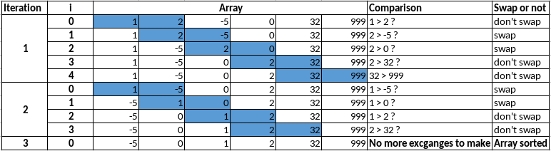
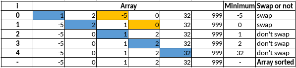
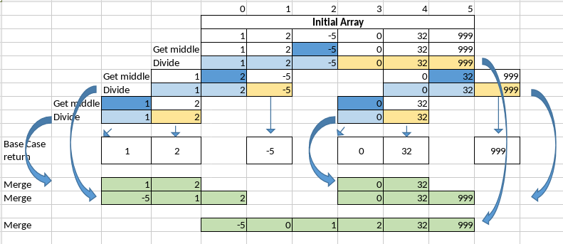
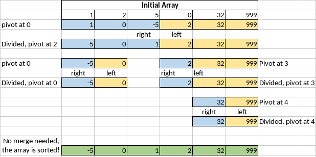
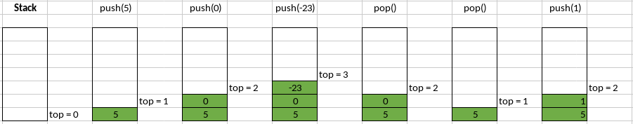
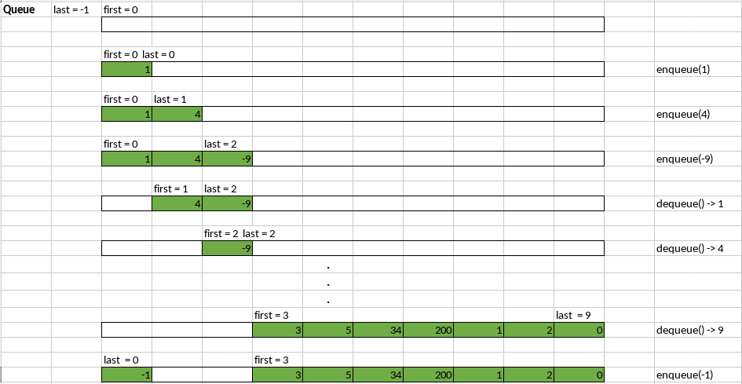

# Data Structures and Algorithms

This repository introduces the beautiful and vast world of DSA (Data Structures and Algorithms). It is a compiling of the most common and useful data structures and algorithms in programming.

> Note: This repo has no intentions to be something scholarly. I just want to share my knowledge about the theme. All the references used here can be found on the internet and are used a lot by the author.

1. [Sorting Algorithms](#sorting-algorithms)
    1. [Bubble Sort](#bubble-sort)
    2. [Selection Sort](#selection-sort)
    3. [Insertion Sort](#insertion-sort)
    4. [Merge Sort](#merge-sort)
    5. [Quick Sort](#quick-sort)
2. [Stack](#stack)
3. [Queue](#queue)


# Sorting Algorithms
Sorting algorithms are a very interesting part of the __Data Structures and Algorithms__ theme. With them, we can understand some of the intricacies of computer science. In this article, I'm going to explain some of the most popular sorting algorithms.


## Bubble Sort
The Bubble Sort is an _exchanging_ algorithm. In Bubble Sort, the ordination happens as the __algorithm iterates over the array comparing the adjacent elements. If the current one is at the incorrect position, it must swap with the next one__, otherwise, the loop goes to the following comparison. This __process finishes when there are no more elements to exchange.__ It means that the array has been sorted.

The process works with two loops: the first one controls if there is still any swap to make; the other makes the comparisons between elements. In each iteration, __the biggest one goes to its right position__ as if it was "floating" like a bubble, which is why the algorithm's name is Bubble Sort.

This method is a simple way to think though it isn't efficient when dealing with a large amount of data.

> In terms of time performance:
>    * Better case: O(N)
>    * Average case: O(N²)
>    * Worst case: O(N²)

Down below is a possibility for the implementation of the Bubble Sort algorithm in the C language:

```
void bubbleSort(int arr[], int n){
    int last_comp;
    int end = n;
    int i;
    int tmp;

    // loop that iterates until there's no more swap to make in the array
    do{
        last_comp = 0;
        // loop to make the comparisons between the adjacent elements
        for(i = 0; i < end-1; i++){
            // comparing the elements
            if(arr[i] > arr[i+1]){
                // swaping positions
                tmp = arr[i];
                arr[i] = arr[i+1];
                arr[i+1] = tmp;
                last_comp = i;
            }
        }
        end--;
    }while(last_comp != 0);

}
```

### Let's see an example of an ascending ordination with Bubble Sort:</br>


[Back to top](#data-structures-and-algorithms)


## Selection Sort
Selection Sort is a selection algorithm. In Selection Sort, the premise is: __the algorithm takes the first element of the array and compares it with all the others that follow when it finds the smallest one, it swaps them. If it doesn't find a smaller element it keeps the same starting array order.__ Then it goes to the next iteration and does the same thing with the second array's element. The process finishes when the penultimate reaches and is compared with the last one.

This process uses two loops: the first one iterates over the array's elements, marking the current element's position as the minimum element's position; the second one checks if this element is bigger than the following ones. When it finds a smaller one, it stores its position as the minimum's position and keeps doing this process until it reaches the last array's element. When it reaches the last one, it checks if the minimum's position is different from the starting stored position. If so, it swaps the element at the starting position with the one at the minimum's position.

This method is not efficient for a large amount of data, though, it is faster than the Bubble Sort.

> In terms of time performance:
>    * Better case: O(N²)
>    * Average case: O(N²)
>    * Worst case: O(N²)

Down below is the implementation of the Selection Sort algorithm in the C language:
```
void selectionSort(int arr[], int n){
    int i;
    int j;
    int min_pos;
    int tmp;

    // loop that marks the current element position
    for(i = 0; i < n-1; i++){
        // assuming that the current element is the minimum element of the sequence
        min_pos = i;
        // loop that makes the comparisons between the current and the other elements
        for(j = i+1; j < n; j++){ 
            // checks if the current element if bigger than one of the following ones
            if(arr[j] < arr[min_pos]){
                // changing the min's position to the smallest element found
                min_pos = j;
            }
        }
        // checks if the minimum element position if diffrent from the current element position
        if(min_pos != i){
            // swaping positions
            tmp = arr[i];
            arr[i] = arr[min_pos];
            arr[min_pos] = tmp;
        }
    }
}
```

### Let's see an example of an ascending ordination with Selection Sort:</br>


[Back to top](#data-structures-and-algorithms)


## Insertion Sort

The Insertion Sort method works with the _insertion_ of elements. A good __analogy__ used to understand Insertion Sort is a __card deck ordination.__ When sorting a cards' deck [i. e: K, J, Q...], we always assume that __the first card (K) is at the correct position__, then when we check the following one (J), __if it's smaller than the first one (K), we put it right before it, and then we have two cards sorted [J, K, Q...].__ If we find another unsorted card (Q) that is __smaller than the second card (K) and bigger than the first one (J), we put the second card (K) ahead of it (Q) and the third one (Q) right into the second's (K's) place, and so on [J, Q, K...].__ This process repeats until the end of the deck.

Insertion Sort algorithm works __separating the array into two parts__: the __first__ part is the __sorted sub-array__, the __second__ one is the __unsorted sub-array__. It walks through the array and __checks if the current element is smaller than the ones on its left-hand side (the sorted sub-array).__

In Insertion Sort, we have two loops: the first one marks the current element; the second one iterates over the sorted sub-array while it finds elements bigger than the current one. These elements walk one position ahead until the current one finds someone smaller than it, thus it goes to the place ahead of this element, and the next iteration comes in.

This algorithm is not efficient for a large amount of data, though, it is faster than the Selection Sort.

> In terms of time performance:
>    * Better case: O(N)
>    * Average case: O(N²)
>    * Worst case: O(N²)


Down below is the implementation of the Insertion Sort algorithm in the C language:
```
void insertionSort(int arr[], int n){
    int i;
    int j;
    int tmp;

    // main loop, it marks the current element
    for(i = 1; i < n; i++){
        tmp = arr[i];   
        // second loop, it moves the elements bigger than the current one, jumping one position ahead 
        for(j = i; (j > 0) && (tmp < arr[j-1]); j--){ 
            arr[j] = arr[j-1];
        }
        // finaly the current is inserted on the right place
        arr[j] = tmp;
        
    }
}
```

### Let's see an example of an ascending ordination with Insertion Sort:</br>


[Back to top](#data-structures-and-algorithms)


## Merge Sort

Merge Sort algorithm uses the __[Divide and Conquer](https://www.programiz.com/dsa/divide-and-conquer) strategy__ to sort elements. It is based on __Recursion__ also. These two things united are the power of Merge Sort. Basically what the algorithm does is to __divide the array until all the elements get isolated__, this means that there is only one element left in each sub-array __(that's the base case of the recursion)__. When it has the elements divided at this level, it begins to _merge_ the sub-arrays created in the past levels.

The algorithm uses two functions: mergeSort() and merge():

### mergeSort():
This function divides the array into __two parts__: __left__ and __right__, to do this, it calculates the _middle_ of the array and calls itself again two times, the first one passing as arguments the array, and the _left part_ indicators, and the second one passing as arguments the array, and the _right part_ indicators. When the base case is reached, the function returns. In the end, it calls the merge() function, which sorts the array.

### merge(): 
This function is responsible for sorting the array passed as an argument. To do that, it uses the _first_, the _middle_, and the _last_ position indicators passed as arguments. It creates the _left_ and _right_ references and a __temporary array__ that will store the sorted values and then override the main array with its values.

It works with a loop that iterates over the temporary array. Inside the loop, the __first thing it does is to check if there's still have elements in both _left_ and _right_ sub-arrays__, if so, __it compares the current element at _left_ side with the one at the _right_ side and puts the smallest one in the temporary array. If some array (left or right) has no more elements to compare, then it gets the elements in the one which still has and puts them into the temporary array__ (because these remaining elements are already sorted). In the end, the function copies the temporary array into the main array.

This is a fast algorithm, especially when it treats large amounts of data. Its negative points are that it uses recursion and creates a temporary array during the sorting process.


> In terms of time performance:
>    * Better case: O(N log(N))
>    * Average case: O(N log(N))
>    * Worst case: O(N log(N))

Down below is the implementation of the Merge Sort algorithm in the C language:
```
void mergeSort(int arr[], int first, int last){
    // checks if there's only one element
    if(first == last){
        return;
    }

    // calculates the middle
    int middle = floor((first+last) / 2);

    // calling merge sort for the left part of the array
    mergeSort(arr, first, middle);
    // calling merge sort for the right part of the array
    mergeSort(arr, middle+1, last);
    // merging the results
    merge(arr, first, middle, last);
}


void merge(int arr[], int first, int middle, int last){
    int *tmp;
    int i;
    int left = first;
    int right = middle + 1;
    int tmp_len = last - first + 1;

    // creating the temporary array dynamically
    tmp = (int *) malloc(tmp_len * sizeof(int));

    if(tmp != NULL){
        // main loop, iterates over the temporary array
        for(i = 0; i < tmp_len; i++){
            // checking if both sub-arrays still have elements
            if((left <= middle) && (right <= last)){
                // comparing the current element at the left sub-array with the current one at right sub-array
                if(arr[left] < arr[right]){
                    // placing the left current element in the temporary array
                    tmp[i] = arr[left];
                    left++;
                }
                else{
                    // placing the right current element in the temporary array
                    tmp[i] = arr[right];
                    right++;
                }
            }
            // if there's no more elements in some of the sub-arrays, put the remaining ones into the temporary array
            else{
                if(left > middle){
                    tmp[i] = arr[right];
                    right++;
                }
                else{
                    tmp[i] = arr[left];
                    left++;
                }
            }
        }
        // copying the temporary array into the main array
        for(int j = 0, i = first; j < tmp_len; j++, i++){
            arr[i] = tmp[j];
        }
    }

    // releasing the temporary array's dynamically allocated space
    free(tmp);
}
```

### Let's see an example of an ascending ordination with Merge Sort:</br>


[Back to top](#data-structures-and-algorithms)


## Quick Sort

QuickSort uses the __[Divide and Conquer](https://www.programiz.com/dsa/divide-and-conquer) and the Recursion strategies__ to sort elements. The main idea in Quick Sort is that it picks up an element as the _pivot_, based on it, it __divides the array into two parts__. After that, the array is sorted by the _partition_ function where the elements at the __left side of the _pivot_ are smaller than it, and the ones at the right side of it are bigger than it.__ The __base case__ of the recursion in Quick Sort is when there's only one element left in the array passed as an argument.

There are two functions we need to build the QuickSort algorithm:

### quickSort()
This function is on to call the _partition_ function and then call itself passing the split main array as an argument: __the first call uses the elements before the _pivot_, and the second one uses the ones after the _pivot_ (never including the pivot).__

### partition()
Partition is the function that chooses the _pivot element_, this can be done in many ways, but the most common ones are to __take the array's first or last element (in my implementation I chose the first one).__ Based on the _pivot_, the _partition()_ function iterates over the sub-array (which is indicated by the _first_ and the _last_ positions) passed as an argument. 

There is the main loop, which checks if the _left_ index is smaller than the _right_ index. Inside the main loop, there are two more loops: the first one __checks if the elements at the _left_ side of the array are smaller than or equal to the _pivot_, while this condition is true the loop increases the _left_ index;__ the second loop __checks if the elements at the right side of the array are bigger than the _pivot_, while this condition is true the loop decreases the _right_ index.__ When these loops are over, there is an _if_ statement to check if the _left_ index is smaller than the _right_ index if this condition is true, __the elements at the _left_ and the _right_ positions are swapped because they are at the wrong side.__

At the end of the main loop, __the _pivot_ goes to the _right_ index's position (because the _right_ index indicates the last element smaller than the pivot) and the right index's element goes to the pivot (first element) position,__ then the _right_ index is returned as the pivot's index.

> Note: the _partition_ function doesn't sort the array, it just recombines the elements in such a way that the elements put at the left side of the _pivot_ are smaller than it, and the ones put at the right side of it are bigger than it. The array is sorted by the recursive call of the method, which calls itself until there's only one element left at each sub-part. At this point, the array is sorted.

Unlike Merge Sort, Quick Sort does not need to create a temporary array to store the sorted parts of the main array, it does that _in place_, which is why Quick Sort is considered better than Merge sort in terms of __Memory efficiency__.

> In terms of time performance:
>    * Better case: O(N log(N))
>    * Average case: O(N log(N))
>    * Worst case: O(N²)

Down below is the implementation of the Quick Sort algorithm in the C language:
```
void quickSort(int arr[], int first, int last){
    // checking if there is more than one element in the array
    if(first < last){
        // calling the partition function and calculating the pivot element
        int pivot = partition(arr, first, last);
        // calling quickSort to the left part of the array
        quickSort(arr, first, pivot-1);
        // calling quickSort to the right part of the array
        quickSort(arr, pivot+1, last);
    }
}

int partition(int arr[], int first, int last){
    int left = first;
    int right = last;
    int tmp;
    int pivot = arr[first];

    // checking if left index still smaller than the right index
    while(left < right){
        // while the current left element is smaller than or equal to the pivot it increases the left index
        while(arr[left] <= pivot){
            left++;
        }
        // while the current right element is bigger than pivot it decreases the right index
        while(arr[right] > pivot){
            right--;
        }
        // checking if left index still smaller than the right index
        if(left < right){
            // swapping elements
            tmp = arr[left];
            arr[left] = arr[right];
            arr[right] = tmp;
        }
    }
    // in the end, the right index element goes to the pivot position and the pivot element goes to the right index
    arr[first] = arr[right];
    arr[right] = pivot;

    return right;
}
```

### Let's see an example of an ascending ordination with QuickSort:</br>


[Back to top](#data-structures-and-algorithms)


# Stack

The Stack is a type of computer science Data Structure. It can be used on reversing a string, save browser navigation URLs allowing users to return to the previously visited site, and control the code execution flow by the OS (Call/Execution Stack) beyond other functionalities.

> Note: in my implementation, I chose to use integers as the stack values' type. The allocation type I chose was the Dynamic allocation.

## Stack working principle

The Stack works with the Last In First Out (LIFO) principle, it means that the last element to enter it is the first element to leave it.



It is composed of basically two elements (attributes): 
* a _top_ indicator, that keeps track of the stack's top element. It can be initialized with 0 or -1 value, it depends on the implementation.
* an _items_ array, which keeps all the stack's elements.

> Note: in my implementation I chose to set _top_ = 0.

The main Stack operations (methods) are:
* push
* pop
* is_empty
* is_full
* length 
* last_item

> Note: additionally to these functions, I've created the _create\_empty\_stack_ and _print\_stack_ functions. These functions' implementation (so as the whole Stack code) can be found at the ./Stack/stack.c file.
  
### Push operation

The _push_ operation includes a new element in the stack. Every new element is placed at the stack's end (its "top"). When this element comes in, the _items_ array recieves it at the _top_ index and then the _top_ indicator is incremented by one.

Here is the implementation of the _push_ function in the C language:

```
void push(stack* stk, int item){
    if (!is_full(stk)){
        stk->items[stk->top] = item;
        stk->top++;
    }
}
```

> Note: because C has no exceptions to throw, it is necessary to control the insertion of elements in the code you're using the stack, the _if(!is\_full)_ statement was placed in the function itself just to guarantee that no items will be pushed to the stack if it is totally filled, so that the _top_ indicator value doesn't get bigger than the FULL_SIZE defined constant, if this happens it would cause an error and allow the stack to grow beyond its FULL_SIZE, never getting full.

### Pop operation

The _pop_ operation removes the last included stack element returning its value. Every time an element is droped from the stack, the _top_ indicator is decremented by one and then the _items_ last element is returned by the function.

Here is the implementation of the _pop_ function in the C language:

```
int pop(stack* stk){
    stk->top--;
    return stk->items[stk->top];
}
```

> Note: because C has no exceptions to throw, it is necessary to control the dropping of elements in the code you're using the stack. In this case, no _if(!is\_empty)_ validations are needed or recommended in the function itself, because the function will return 0 (zero) by default even if there were no more items to drop. Leaving it without validation causes a _segmentation error_ which crashes the program because the _top_ indicator value gets negative when it's attempted to drop elements and there are no more elements to drop.

### Is empty operation

To check if the stack is empty (on my implementation), we just need to check if the _top_ value is euqal to 0 (zero).

Here is the implementation of the _is\_empty_ function in the C language:

```
bool is_empty(stack* stk){
    return (stk->top == 0);
}
```

### Is full operation

To check if the stack is full (on my implementation), we just need to check if the _top_ value is equal to the FULL_SIZE (10 in this case) defined constant value.

Here is the implementation of the _is\_full_ function in the C language:

```
bool is_full(stack* stk){
    return (stk->top == FULL_SIZE);
}
```

### Length operation

The _length_ operation returns how many elements there are in the stack, (on my implementation) it just returns the value of _top_.

Here is the implementation of the _length_ function in the C language:

```
int length(stack* stk){
    return stk->top;
}
```

### Last item operation

The _last\_item_ operation just returns the last stack element's value without removing it from the stack. 

Here is the implementation of the _last\_item_ function in the C language:

```
int last_item(stack* stk){
    return stk->items[stk->top-1];
}
```

> Note: on my implementation I needed to return the _items_ array at the _top-1_ index, because the _top_ indicator was initialized as 0 (zero).

[Back to top](#data-structures-and-algorithms)


# Queue

The Queue is a type of computer science Data Structure. It can be used to control the order in which processes must execute in a computer system, handling interrupts on real-time systems, and other functionalities, like defining a priority for all its elements.

> Note: in my implementation, I chose to use integers as the queue values' type; The allocation type I chose was the Dynamic allocation; There are several queue types, like the Simple Queue, the Circular Queue, the Priority Queue and the Double Ended Queue (Deque). This article refers to the Circular Queue implementation.

## Queue working principle

The Queue works with the First In First Out (FIFO) principle, it means that the first element to enter it is the first element to leave it.



It is basicaly composed of four elements (attributes):

* an _items_ array, which keeps all the queue's elements.
* a _first_ indicator, which points to the queue's first element.
* a _last_ indicator, which points to the queue's last element.
* a _len_ indicator that keeps the quantity of elements in the queue.

> Note: in my implementation I chose to set _first_ = 0 and _last_ = -1.

The main Queue's operations (methods) are:

* enqueue
* dequeue
* is_full
* is_empty
* get_first
* get_last
* length

> Note: additionally to these functions, I've created the _create\_empty\_queue_ and _print\_queue_ functions. These functions' implementation (so as the whole Queue code) can be found at the ./Queue/queue.c file.

### Enqueue operation

The _enqueue_ operation includes a new element in the queue. Every new element is placed at the queue's end. Because this is a __Circular Queue__, the _last_ indicator must be updated in a different way (rather than just incrementing its value by one) before an enqueuing the element. The formula used to update _last's_ value is: `(_last_ + 1) % queue_full_size`, where:

* _last_ is the value of the _last_ indicator
* _queue\_full\_size_ is the max size of the queue (when it is filled)

After updating the _last_ index, the _items_ array recieves the new item at the position of _last_ index. To finish, the _len_ attribute is incremented by one.

Here is the implementation of the _enqueue_ function in the C language:

```
void enqueue(queue* q, int elm) {
    if(!is_full(q)) {
        q->last = (q->last+1) % FULL_SIZE;
        q->items[q->last] = elm;
        q->len++;
    }
}
```

### Dequeue operation

The _dequeue_ operation removes the first queue element returning its value. Every time an element is droped from the queue, the _first_ indicator is updated by the same principle used to update _last_ in the _enqueue_ function, the only change is that instead of _last_ we use the _first_ indicator value in the formula: `(_first_+1) % queue_full_size`. Then the _len_ value is decreased by one and the _items_ first element is returned.

Here is the implementation of the _dequeue_ function in the C language:

```
int dequeue(queue* q) {
    int out = q->items[q->first];
    q->first = (q->first+1) % FULL_SIZE;
    q->len--;
    return out;
}
```

### Is empty operation

To check if the queue is empty (on my implementation), we just need to check if the _len_ value is euqal to 0 (zero).

Here is the implementation of the _is\_empty_ function in the C language:

```
bool is_empty(queue* q) {
    return q->len == 0;
}
```

### Is full operation

To check if the queue is full (on my implementation), we just need to check if the _len_ value is equal to the FULL_SIZE (10 in this case) defined constant value.

Here is the implementation of the _is\_full_ function in the C language:

```
bool is_full(queue* q) {
    return q->len == FULL_SIZE;
}
```

### Length operation

The _length_ operation returns how many elements there are in the queue, (on my implementation) it just returns the value of _len_.

Here is the implementation of the _length_ function in the C language:

```
int length(queue* q) {
    return q->len;
}
```

### First item operation

The _get\_first_ operation just returns the element pointed by the _first_ indicator without removing it. 

Here is the implementation of the _get\_first_ function in the C language:

```
int get_first(queue* q) {
    return q->items[q->first];
}
```

### Last item operation

The _get\_last_ operation just returns the element pointed by the _last_ indicator without removing it. 

Here is the implementation of the _get\_last_ function in the C language:

```
int get_last(queue* q) {
    return q->items[q->last];
}
```

[Back to top](#data-structures-and-algorithms)

# References:

[LAMFO - Sorting Algorithms](https://lamfo-unb.github.io/2019/04/21/Sorting-algorithms/)</br>
[Programiz - DSA](https://www.programiz.com/dsa)</br>
[Programiz - DSA stack](https://www.programiz.com/dsa/stack)<br>
[Programiz - DSA queues](https://www.programiz.com/dsa/queue)<br>
[Programiz - DSA cisrcular-queues](https://www.programiz.com/dsa/circular-queue)<br>
[Linguagem C Descomplicada](https://programacaodescomplicada.wordpress.com/indice/estrutura-de-dados/)</br>
[FACE Prep](https://www.faceprep.in/c/sorting-algorithms/)

> Note: The links referenced in this article were accessed on 2021-01-30 21:13:00 by the last time. All explanations and images used were prepared by the author himself, using as a basis the texts contained in the referred links.
