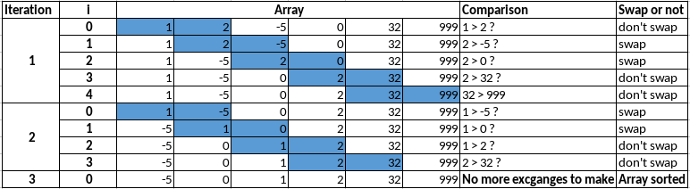
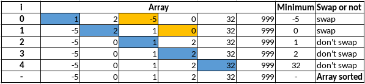
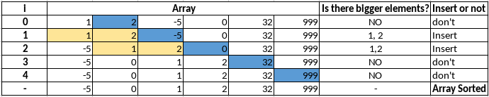

# Sorting Algorithms

The sorting algorithms are a very interesting part of the Data Structures and Algorithms theme. With them, we can understand some of the intricacies of computer science. In this article, I'm going to explain some of the most popular sorting algorithms.


## Bubble Sort

The Bubble Sort is an _exchanging_ algorithm. In Bubble Sort, the ordination happens as the __algorithm iterates through the array comparing the adjacent elements, if the current is in the incorrect position, it must swap with the next one__, else, the loop goes to the following comparison. This __procedure finishes when there are no more elements to swap__ it means that the array sorted.

The process happens with __two loops__: the first one controls if there is still swap to make; the other one makes the comparisons between the elements. In each iteration, __the biggest (or the smallest, it depends if the order is ascending or descending) one goes to its right position__ as if it was "floating" like a bubble, which is why the algorithm's name is Bubble Sort.

This method is a simple way to think when it comes to sorting, though, it's not efficient for a large amount of data.

> In terms of time performance:
>    * Better case: O(N)
>    * Average case: O(N²)
>    * Worst case: O(N²)

Down below is one possibility for the implementation of the Bubble Sort algorithm in C:

```
void bubbleSort(int arr[], int n){
    int last_comp;
    int end = n;
    int i;
    int tmp;

    // loop that iterates until there's no more swap to make in the array
    do{
        last_comp = 0;
        // loop to make the comparisons between the adjacent elements
        for(i = 0; i < end-1; i++){
            // the actual comparison (to make it in descending order change '>' to '<')
            if(arr[i] > arr[i+1]){
                // swaping positions
                tmp = arr[i];
                arr[i] = arr[i+1];
                arr[i+1] = tmp;
                last_comp = i;
            }
        }
        end--;
    }while(last_comp != 0);

}
```

### Let's see an example of an ascending ordination:</br>



## Selection Sort

The Selection Sort (as the name says) is a _selection_ algorithm. In Selection Sort, __the premise is: the algorithm takes the first element of the array and compares it with all the other that follow when it finds the smallest (or the biggest one, it depends if the order is ascending or descending) element, it swaps them,  if it does not find a smaller one it keeps the same starting array order__. Then it goes to the next iteration and does the same thing with the second element. __The process finishes when the penultimate reaches and compared with the last one.__

The process uses __two loops__, the first one iterates over all the elements in the array, marking the current element's position as the position of the minimum element; the second one checks if this element is bigger (or smaller, it depends if the order is ascending or descending) than the following ones in the array. __When it finds a smaller one, it stores its position as the minimum's position and keeps doing this process until it reaches the last array's element. When it reaches the last one, it checks if the minimum's position is different from the starting position stored. If so, it swaps the element in the starting position with the one in the minimum's position.__

This method is not efficient for a large amount of data, though, it is faster than the Bubble Sort.

> In terms of time performance:
>    * Better case: O(N²)
>    * Average case: O(N²)
>    * Worst case: O(N²)

Down below is the implementation of the Selection Sort algorithm in C:
```
void selectionSort(int arr[], int n){
    int i;
    int j;
    int min_pos;
    int tmp;

    // loop to mark the current element position
    for(i = 0; i < n-1; i++){
        // assuming that the current element is the minimum element of the sequence
        min_pos = i;
        // loop to make the comparisons between the current element and the other elements
        for(j = i+1; j < n; j++){ 
            // checks if the current element if smaller than the following ones
            if(arr[j] < arr[min_pos]){
                min_pos = j;
            }
        }
        // checks if the minimum element position if diffrent from the current element position
        if(min_pos != i){
            // swaping positions
            tmp = arr[i];
            arr[i] = arr[min_pos];
            arr[min_pos] = tmp;
        }
    }
}
```

### Let's see an example of an ascending ordination:</br>


## Insertion Sort

The Insertion Sort method (as the name says) works with the _insertion_ of elements. A good and common __analogy__ used to understand Insertion Sort is a __card deck ordination__. When sorting a cards deck, we always assume that __the first card is already sorted__, then when we check the following one, __if it's smaller than the first one, we put it right before it, and then we have two cards sorted__. If we find another unsorted card that is __smaller than the second card and bigger than the first we pass the second card ahead and put this third one right into the second's place, and so on.__ This process repeats until the end of the deck.

Insertion Sort algorithm works __separating the array into two parts__: the __first__ part is the __sorted sub-array__, the __second__ one is the __unsorted sub-array__. It walks through the array and __checks if the current element is smaller than the ones on its left-hand side (the sorted sub-array).__

In Insertion Sort, we have __two loops__: the first one marks the current element; __the second one iterates over the sorted sub-array while it finds elements that are smaller than the current one.__ When this situation happens, __the elements that are bigger than the current one walk one position ahead until the current one finds someone smaller than it, thus it goes to the place ahead of this element, and the next iteration comes in.__

This algorithm is not efficient for a large amount of data, though, it is faster than the Selection Sort.

> In terms of time performance:
>    * Better case: O(N)
>    * Average case: O(N²)
>    * Worst case: O(N²)


Down below is the implementation of the Insertion Sort algorithm in C
```
void insertionSort(int arr[], int n){
    int i;
    int j;
    int tmp;

    for(i = 1; i < n; i++){
        tmp = arr[i];   
        for(j = i; (j > 0) && (tmp < arr[j-1]); j--){    
            arr[j] = arr[j-1];
        }
        arr[j] = tmp;
    }
}
```

### Let's see an example of an ascending ordination:</br>


## References:

[LAMFO - Sorting Algorithms](https://lamfo-unb.github.io/2019/04/21/Sorting-algorithms/)</br>
[Programiz - DSA](https://www.programiz.com/dsa)</br>
[Linguagem C Descomplicada](https://programacaodescomplicada.wordpress.com/indice/estrutura-de-dados/)</br>
[FACE Prep](https://www.faceprep.in/c/sorting-algorithms/)